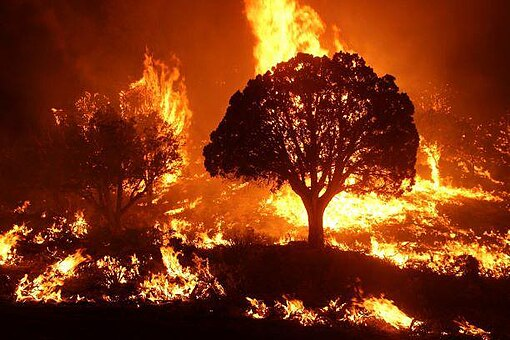
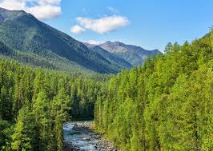

# Forest_Fire_Detection
# 🌲 Forest Fire Detection using Deep Learning 🔥

This repository contains a deep learning project that detects forest fires in images using a Convolutional Neural Network (CNN). It is implemented in Python using TensorFlow/Keras and is designed to help with early wildfire detection systems.


## 🧠 Model Overview

The model is a CNN trained on a labeled dataset of forest images categorized as **Fire** or **No Fire**. The network learns spatial features in the images to make binary classification predictions.

## 📦 Requirements

- Python 3.7+
- TensorFlow or Keras
- NumPy
- Matplotlib
- scikit-learn
- OpenCV (optional, for image preprocessing)

## Install dependencies with:

```bash
pip install -r requirements.txt

```

## ✅ Dataset is directly imported from kagglehub.
```bash
import kagglehub

path = kagglehub.dataset_download("elmadafri/the-wildfire-dataset")

print("Path to dataset files:", path)
```
## 🖼️ Sample Output
Fire


No Fire



